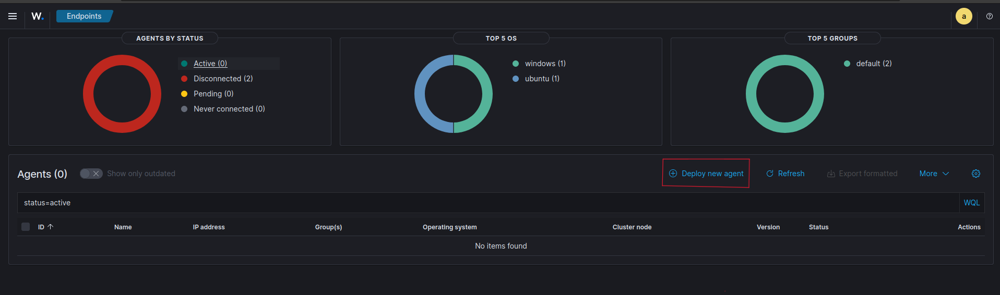
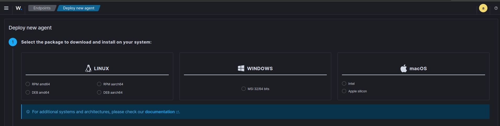
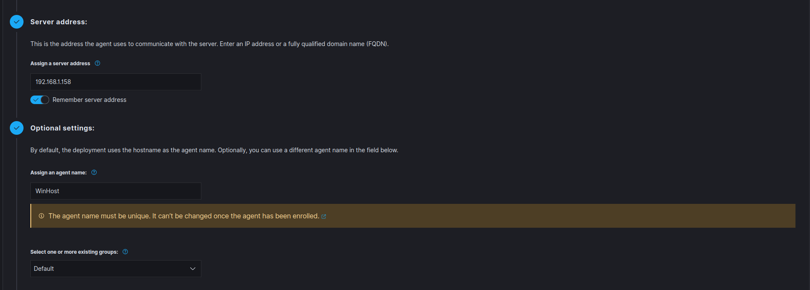
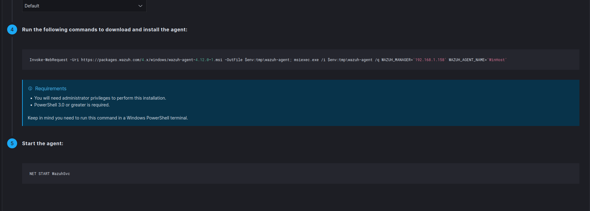
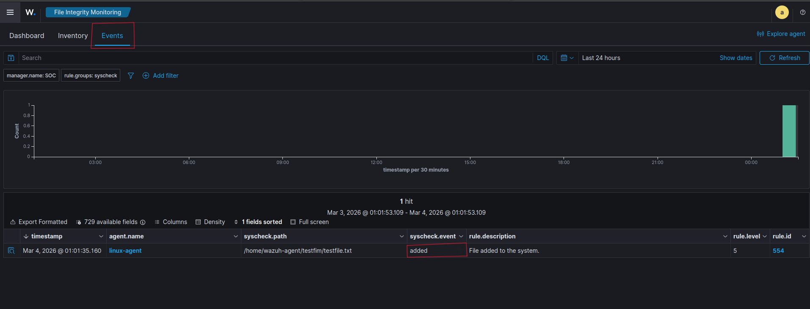
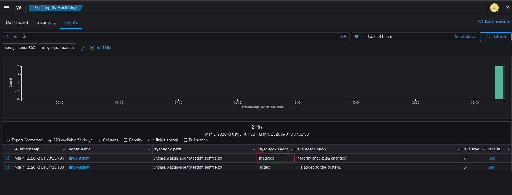
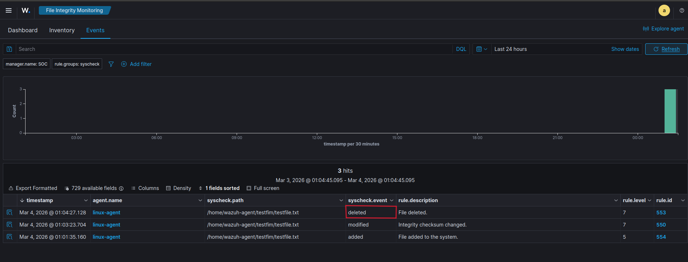
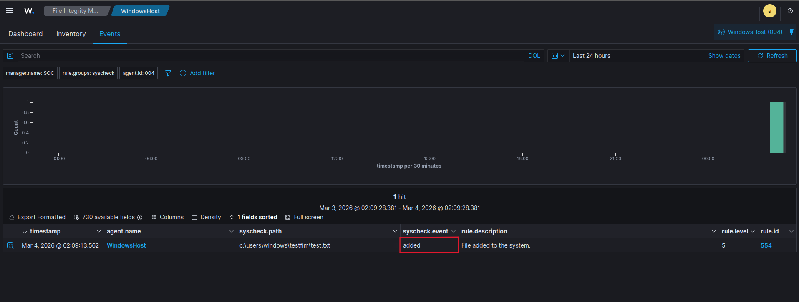
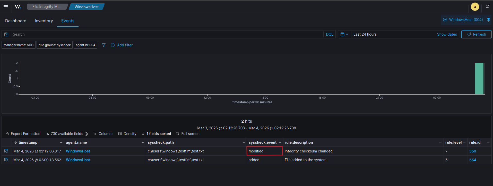

# 01 — File Integrity Monitoring

## Objective

Demonstrate how **Wazuh FIM** detects the three core file system events — **Create**, **Modify**, and **Delete** — on both a Linux agent and a Windows agent in real-time.

---

## 🧠 What is FIM?

File Integrity Monitoring (FIM) tracks changes to files and directories on a system. Wazuh creates a baseline (hash) of monitored files and alerts whenever that baseline changes. This helps detect:

- Unauthorized file modifications
- Malicious files being dropped on the system
- Evidence being deleted or tampered with

---

## 🖥️ Infrastructure

| Machine   | OS                  | Role           | Key Components                    |
|-----------|---------------------|----------------|-----------------------------------|
| Machine 1 | Ubuntu Server 22.04 | Wazuh Manager  | Wazuh Manager, Indexer, Dashboard |
| Machine 2 | Ubuntu 22.04        | Wazuh Agent    | Wazuh Agent                       |
| Machine 3 | Windows 11          | Wazuh Agent    | Wazuh Agent, Windows Event Logs   |


**Minimum Hardware for Wazuh Server:**
- **CPU:** 2 vCPUs
- **RAM:** 4 GB+
- **Storage:** 50 GB+

**Prerequisites:**
- Network connectivity between all machines
- Root or sudo privileges on Linux machines; Administrator on Windows

---

## 🚀 Install Wazuh Server (Quick Start)

### Step 1 — Download and run the installation assistant

```bash
curl -sO https://packages.wazuh.com/4.14/wazuh-install.sh && sudo bash ./wazuh-install.sh -a
```

Once complete, the output displays your access credentials:

```
INFO: --- Summary ---
INFO: You can access the web interface https://<WAZUH_DASHBOARD_IP_ADDRESS>
    User: admin
    Password: <ADMIN_PASSWORD>
INFO: Installation finished.
```

### Step 2 — Access the Wazuh Dashboard

Navigate to `https://<WAZUH_DASHBOARD_IP_ADDRESS>` and log in with:
- **Username:** `admin`
- **Password:** `<ADMIN_PASSWORD>`

### Step 3 — Deploy Agents

Go to **Agents Management > Summary** and click **Deploy new agent**. Follow the on-screen steps to select the OS and register each agent.





---

## ⚙️ Configuration

FIM is configured inside the `<syscheck>` block in `ossec.conf` on each agent. After editing the config, **always restart the agent** for changes to take effect.

---

### 🐧 Linux — `/var/ossec/etc/ossec.conf`

```xml
<syscheck>
  <frequency>43200</frequency>
  <scan_on_start>yes</scan_on_start>
  <directories realtime="yes" check_all="yes">/home/wazuh-agent/testfim</directories>
</syscheck>
```

**Restart the agent:**

```bash
sudo systemctl restart wazuh-agent
```

---

### 🪟 Windows — `C:\Program Files (x86)\ossec-agent\ossec.conf`

```xml
<syscheck>
  <frequency>43200</frequency>
  <scan_on_start>yes</scan_on_start>
  <directories recursion_level="4" realtime="yes" check_all="yes" report_changes="yes">C:\Users\Windows\testfim</directories>
</syscheck>
```

**Restart the agent (PowerShell as Administrator):**

```powershell
Restart-Service -Name WazuhSvc
```

---

### 📝 Configuration Notes

| Option | Description |
|---|---|
| `realtime="yes"` | Enables instant detection using **inotify** on Linux and **VSS** on Windows |
| `scan_on_start="yes"` | Forces a baseline scan immediately when the agent starts |
| `report_changes="yes"` | Logs a diff of file content changes in addition to hash changes (Windows) |
| `check_all="yes"` | Checks MD5, SHA1, SHA256, size, permissions, owner, and modification time |

---

## 🧪 Testing — Linux

All tests are performed inside the monitored directory `/home/wazuh-agent/testfim`.

### ✅ Create

```bash
touch /home/wazuh-agent/testfim/testfile.txt
```

**Alert generated:**



```
Rule: 554 - File added to the system.
File: /home/wazuh-agent/testfim/testfile.txt
```

---

### ✏️ Modify

```bash
echo "hello" >> /home/wazuh-agent/testfim/testfile.txt
```

**Alert generated:**



```
Rule: 550 - Integrity checksum changed.
File: /home/wazuh-agent/testfim/testfile.txt
Changed attributes: md5, sha1, sha256, size
```

---

### 🗑️ Delete

```bash
rm /home/wazuh-agent/testfim/testfile.txt
```

**Alert generated:**



```
Rule: 553 - File deleted.
File: /home/wazuh-agent/testfim/testfile.txt
```

---

## 🧪 Testing — Windows

All tests are performed inside the monitored directory `C:\Users\Windows\testfim`.

### ✅ Create

```powershell
New-Item -Path "C:\Users\Win\testfim\testfile.txt" -ItemType File
```

**Alert generated:**



```
Rule: 554 - File added to the system.
File: C:\Users\Windows\testfim\testfile.txt
```

---

### ✏️ Modify

```powershell
Add-Content -Path "C:\Users\Win\testfim\testfile.txt" -Value "hello"
```

**Alert generated:**



```
Rule: 550 - Integrity checksum changed.
File: C:\Users\Windows\testfim\testfile.txt
Changed attributes: md5, sha1, sha256, size
```

---

### 🗑️ Delete

```powershell
Remove-Item -Path "C:\Users\Win\testfim\testfile.txt"
```

**Alert generated:**


```
Rule: 553 - File deleted.
File: C:\Users\Windows\testfim\testfile.txt
```

---

## 📊 Summary

| Event         | Linux        | Windows      | Wazuh Rule |
|---------------|-------------|-------------|------------|
| File Created  | ✅ Detected  | ✅ Detected  | Rule 554   |
| File Modified | ✅ Detected  | ✅ Detected  | Rule 550   |
| File Deleted  | ✅ Detected  | ✅ Detected  | Rule 553   |

---

## 🔑 Key Takeaway

Wazuh FIM successfully detects all three core file events in real-time on both Linux and Windows, making it an effective tool for monitoring unauthorized changes across a mixed-OS environment.

---

[← Back to Main Portfolio](../README.md)