# 🛡️ SSH Brute Force Detection & Automated Response
### Wazuh SIEM · MITRE ATT&CK T1110 · Home Lab


> **A full-cycle SSH brute force simulation** — from credential spraying to successful compromise — detected, correlated, and automatically blocked using Wazuh SIEM in a controlled home lab environment.

---

## 📑 Table of Contents

- [Key Results](#-key-results)
- [Lab Environment](#-lab-environment)
- [Attack Simulation](#-attack-simulation)
- [Detection & Alert Escalation](#-detection--alert-escalation)
- [Alert Breakdown](#-alert-breakdown)
- [MITRE ATT&CK Mapping](#-mitre-attck-mapping)
- [Compliance Frameworks](#-compliance-frameworks-triggered)
- [Active Response](#-active-response)
- [Defensive Recommendations](#-defensive-recommendations)
- [Disclaimer](#-disclaimer)

---

## 🏆 Key Results

| Metric | Value |
|--------|-------|
| Total Alerts Fired | **7 correlated alerts** |
| Alert Severity Range | Level 5 → Level 12 (Critical) |
| Attacker IP Blocked | ✅ Automatically via `firewall-drop` |
| MITRE Techniques Covered | T1110, T1110.001, T1078, T1021.004 |
| Compliance Frameworks Hit | NIST 800-53, PCI DSS, GDPR, HIPAA, TSC |

---

## 🖥️ Lab Environment

| Role | Hostname | IP Address | OS |
|------|----------|------------|----|
| SIEM Manager | `SOC` | 192.168.1.165 | Ubuntu |
| Target (Agent) | `linux-agent` | 192.168.1.164 | Ubuntu |
| Attacker | `kali` | 192.168.1.166 | Kali Linux |

> All activity was performed in a **fully isolated virtual lab**. No production systems were involved.

**Architecture:**


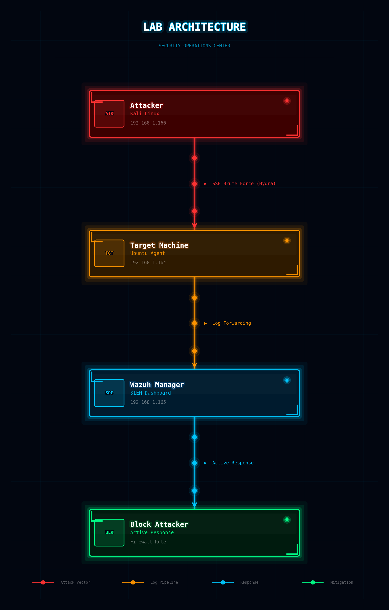


---

## ⚙️ Tools & Technologies

| Tool | Purpose |
|------|---------|
| [Wazuh](https://wazuh.com/) | SIEM / XDR — alert correlation, log analysis, active response |
| [Hydra](https://github.com/vanhauser-thc/thc-hydra) | Brute force credential testing |
| OpenSSH | Target service being attacked |
| PAM | Linux authentication framework — additional log source |

---

## ⚔️ Attack Simulation

### Step 1 — Prepare the Password Wordlist

On the attacker machine (Kali Linux), a custom wordlist was created to simulate a dictionary attack:

```bash
nano passwords.txt
```

```
123456
password
admin
linux
test123
```

### Step 2 — Launch the Brute Force Attack

```bash
hydra -l linux-agent -P passwords.txt 192.168.1.164 ssh -V
```

Hydra systematically attempts every password in the list against the SSH service on the target machine using the username `linux-agent`. Each attempt generates authentication events picked up by Wazuh's SSH and PAM decoders.

---
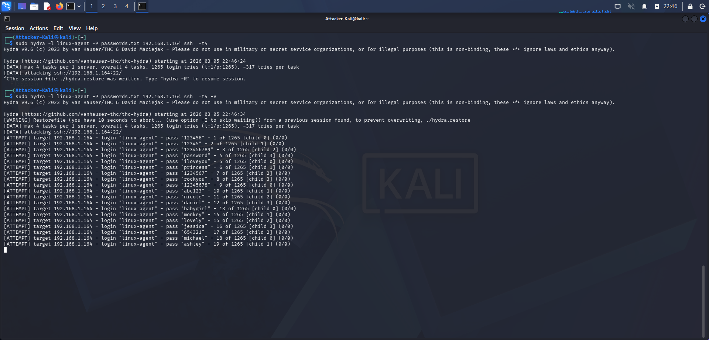
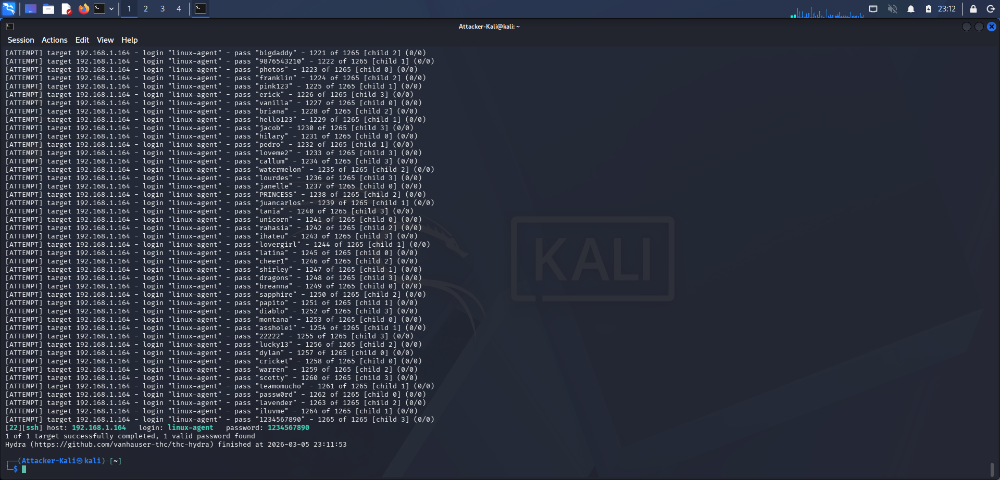

## 📈 Detection & Alert Escalation

Wazuh did not fire a single alert in isolation — it **built a case**. Each failed login contributed to a growing confidence score, culminating in a Critical Level 12 alert the moment the attacker succeeded.

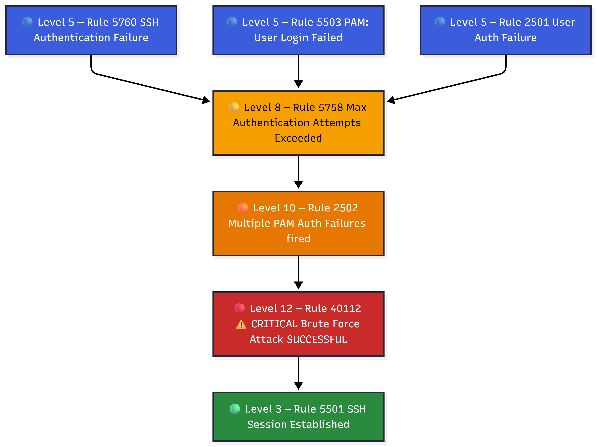

---

## 🚨 Alert Breakdown

### 1️⃣ SSH Authentication Failure — Rule 5760 · `Level 5`

| Field | Value |
|-------|-------|
| **Rule ID** | 5760 |
| **Severity** | Level 5 |
| **Times Fired** | 89 |
| **MITRE Technique** | T1110.001 — Password Guessing |

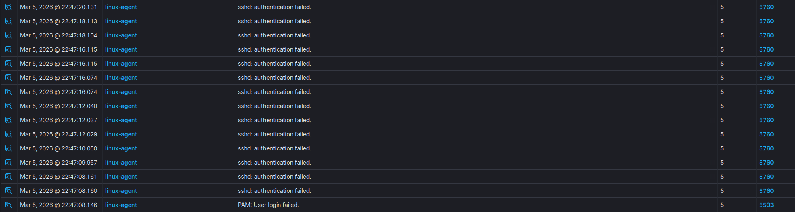

**Trigger Log:**
```
Failed password for linux-agent from 192.168.1.166 port 36866 ssh2
```
Each failed attempt is logged by `sshd` and decoded by Wazuh's SSH decoder. At this stage the attack is visible, but not yet confirmed as a brute force campaign.

---

### 2️⃣ Maximum Authentication Attempts Exceeded — Rule 5758 · `Level 8`

| Field | Value |
|-------|-------|
| **Rule ID** | 5758 |
| **Severity** | Level 8 |
| **Times Fired** | 117 |
| **MITRE Technique** | T1110 — Brute Force |

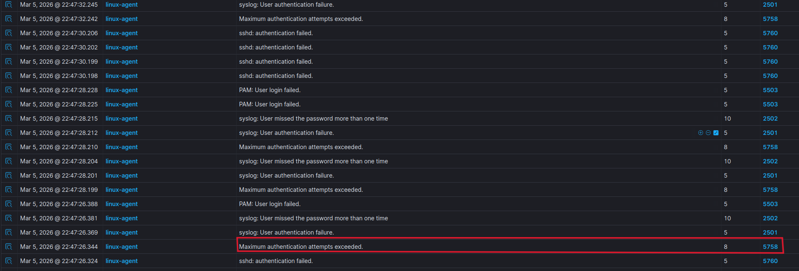

**Trigger Log:**
```
error: maximum authentication attempts exceeded for linux-agent from 192.168.1.166 port 36872 ssh2 [preauth]
```
SSH's built-in `MaxAuthTries` threshold was reached — confirming the source IP is systematically cycling through credentials.

---

### 3️⃣ User Authentication Failure (Syslog) — Rule 2501 · `Level 5`

| Field | Value |
|-------|-------|
| **Rule ID** | 2501 |
| **Severity** | Level 5 |
| **Times Fired** | 115 |
| **MITRE Technique** | T1110 — Brute Force |

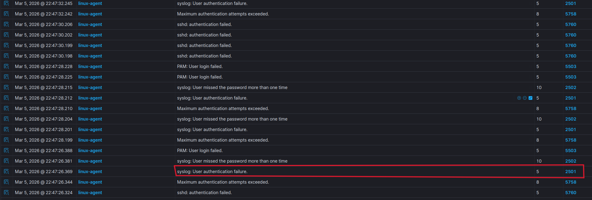

**Trigger Log:**
```
Disconnecting authenticating user linux-agent 192.168.1.166 port 36858: Too many authentication failures [preauth]
```

---

### 4️⃣ PAM: User Login Failed — Rule 5503 · `Level 5`

| Field | Value |
|-------|-------|
| **Rule ID** | 5503 |
| **Severity** | Level 5 |
| **Times Fired** | 99 |
| **MITRE Technique** | T1110.001 — Password Guessing |

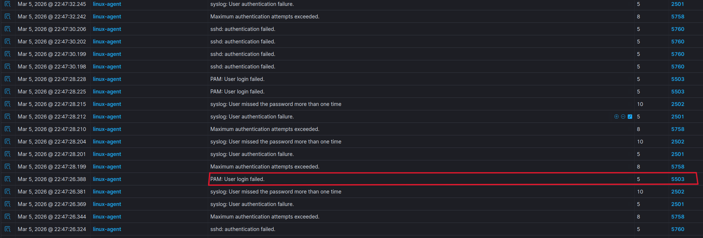

**Trigger Log:**
```
pam_unix(sshd:auth): authentication failure; logname= uid=0 euid=0 tty=ssh ruser= rhost=192.168.1.166 user=linux-agent
```
PAM-level failures provide an additional corroboration layer, strengthening Wazuh's alert confidence.

---

### 5️⃣ Multiple Authentication Failures (PAM) — Rule 2502 · `Level 10`

| Field | Value |
|-------|-------|
| **Rule ID** | 2502 |
| **Severity** | Level 10 |
| **Times Fired** | 93 |
| **MITRE Technique** | T1110 — Brute Force |

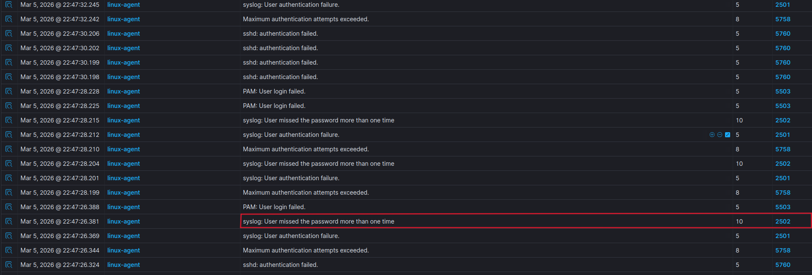

**Trigger Log:**
```
PAM 5 more authentication failures; logname= uid=0 euid=0 tty=ssh ruser= rhost=192.168.1.166 user=linux-agent
```
Volume of failures far beyond what any legitimate user would generate — brute force pattern confirmed at the PAM layer.

---

### 6️⃣ 🔴 Brute Force Attack Successful — Rule 40112 · `Level 12 CRITICAL`

| Field | Value |
|-------|-------|
| **Rule ID** | 40112 |
| **Severity** | **Level 12 — Critical** |
| **Times Fired** | 1 |
| **MITRE Techniques** | T1110 — Brute Force · T1078 — Valid Accounts |
| **MITRE Tactics** | Credential Access · Initial Access · Persistence · Privilege Escalation · Defense Evasion |

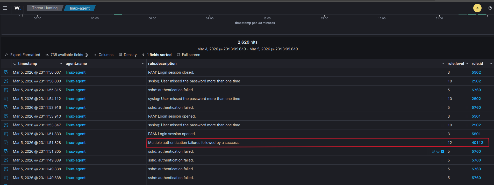

**Trigger Log:**
```
Accepted password for linux-agent from 192.168.1.166 port 47254 ssh2
```
Wazuh's composite rule **40112** fired the moment it detected a **successful login immediately following a series of failures from the same source IP** — the definitive signature of a completed brute force attack.

---

### 7️⃣ SSH Session Established — Rule 5501 · `Level 3`

| Field | Value |
|-------|-------|
| **Rule ID** | 5501 |
| **Severity** | Level 3 |
| **MITRE Technique** | T1078 — Valid Accounts |

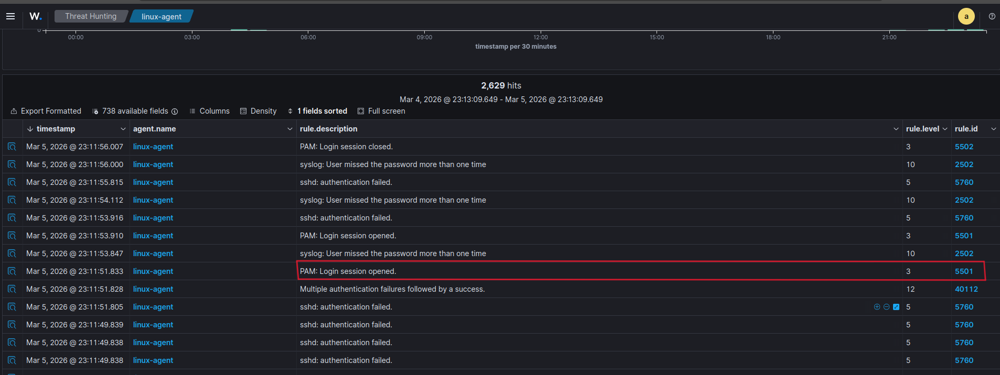

**Trigger Log:**
```
pam_unix(sshd:session): session opened for user linux-agent(uid=1002) by (uid=0)
```
A PAM session was opened — the attacker now has an **interactive shell** on the target machine.

---

## 🧩 MITRE ATT&CK Mapping

| Technique ID | Technique Name | Tactic | Observed |
|-------------|----------------|--------|----------|
| T1110 | Brute Force | Credential Access | ✅ |
| T1110.001 | Password Guessing | Credential Access | ✅ |
| T1078 | Valid Accounts | Initial Access · Persistence · Privilege Escalation · Defense Evasion | ✅ |
| T1021.004 | Remote Services: SSH | Lateral Movement | ✅ |

---

## 🔐 Compliance Frameworks Triggered

| Framework | Controls |
|-----------|---------|
| **NIST 800-53** | AU.14, AC.7, SI.4 |
| **PCI DSS** | 10.2.4, 10.2.5, 11.4 |
| **GDPR** | IV_35.7.d, IV_32.2 |
| **HIPAA** | 164.312.b |
| **TSC** | CC6.1, CC6.8, CC7.2, CC7.3 |

---

## ⚡ Active Response

### 🎯 Objective

Automatically **block the attacker's IP address** the moment brute force behavior is detected — before a successful login can occur.

---
### 🔥 Active Response Flow

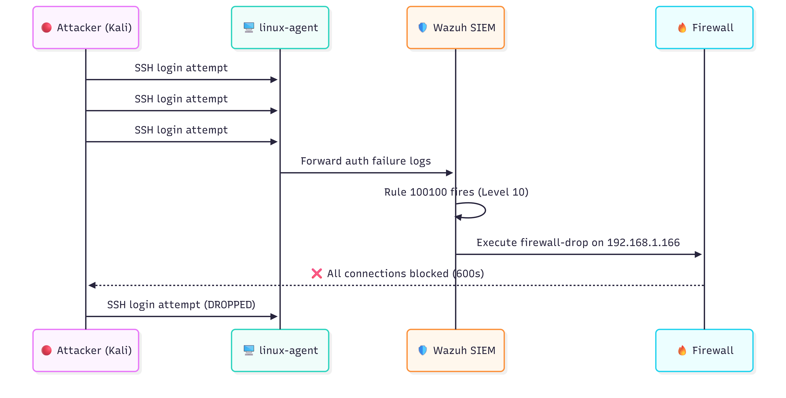

### Step 1 — Create Custom Detection Rules

Edit `/var/ossec/etc/rules/local_rules.xml`:

```xml
<group name="ssh,bruteforce,">

  <!-- Detect brute force pattern -->
  <rule id="100100" level="10">
    <if_sid>5763</if_sid>
    <description>SSH Brute Force detected</description>
    <mitre>
      <id>T1110</id>
    </mitre>
  </rule>

  <!-- Detect successful login following brute force -->
  <rule id="100101" level="12">
    <if_sid>40112</if_sid>
    <if_matched_sid>100100</if_matched_sid>
    <description>SSH Brute Force SUCCESS</description>
    <mitre>
      <id>T1110</id>
      <id>T1078</id>
    </mitre>
  </rule>

</group>
```
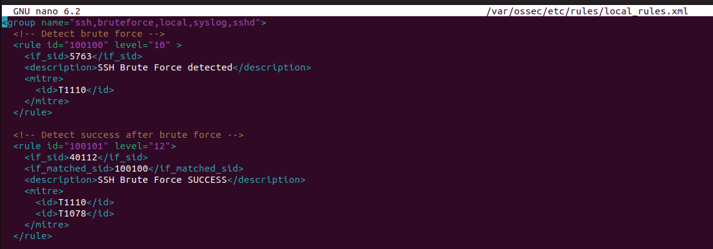
---

### Step 2 — Configure Active Response Block

Edit `/var/ossec/etc/ossec.conf`:

```xml
<active-response>
  <command>firewall-drop</command>
  <location>local</location>
  <rules_id>100100</rules_id>
  <timeout>600</timeout>
</active-response>
```
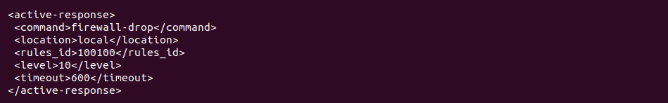

> The attacker IP is blocked for **600 seconds (10 minutes)** automatically on rule 100100 trigger.

---

### Step 3 — Apply Configuration

```bash
systemctl restart wazuh-manager
```
---

### Step 4 — Verify the Response

Re-run the Hydra attack and observe:

```bash
hydra -l linux-agent -P passwords.txt 192.168.1.164 ssh -V
```

✅ Rule **100100** fires in the Wazuh dashboard  
✅ `firewall-drop` executes automatically  
✅ Attacker IP is blocked — further connection attempts are dropped  
✅ Attack is terminated without manual intervention  

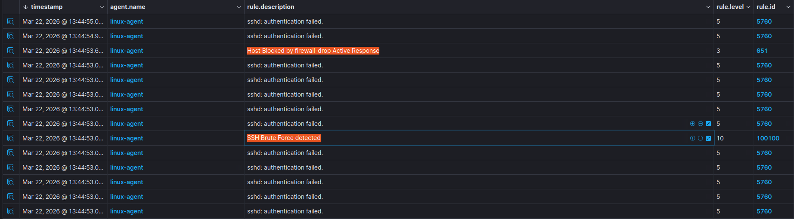

---

---

## 🛡️ Defensive Recommendations

| Control | Recommendation |
|---------|---------------|
| 🔑 **Authentication** | Disable password auth — enforce SSH key-based authentication only |
| 🚦 **Rate Limiting** | Configure `MaxAuthTries` and `LoginGraceTime` in `sshd_config` |
| 🔌 **Port Hardening** | Change default SSH port from 22 to a non-standard port |
| 📱 **MFA** | Enable Multi-Factor Authentication for all SSH access |
| 👀 **Monitoring** | Forward all auth logs to a SIEM for continuous detection |
| 🚫 **IP Allowlist** | Restrict SSH access by IP allowlist where applicable |

---

## 👤 Author

Built as part of a hands-on **SOC / Blue Team home lab** to develop practical skills in threat detection, log analysis, and incident response.

---

## ⚠️ Disclaimer

This project was conducted in a **fully isolated, controlled lab environment** for educational purposes only. All techniques demonstrated are intended to improve defensive security skills. **Do not replicate this activity on systems you do not own or have explicit permission to test.**
